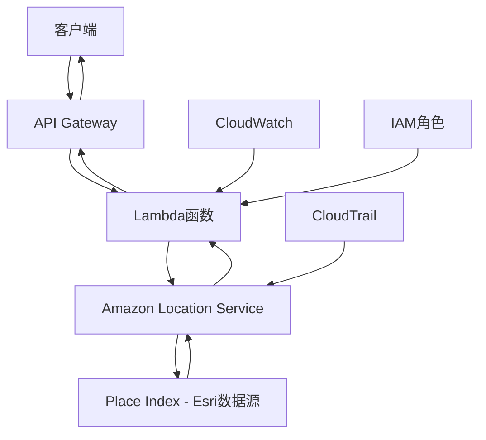
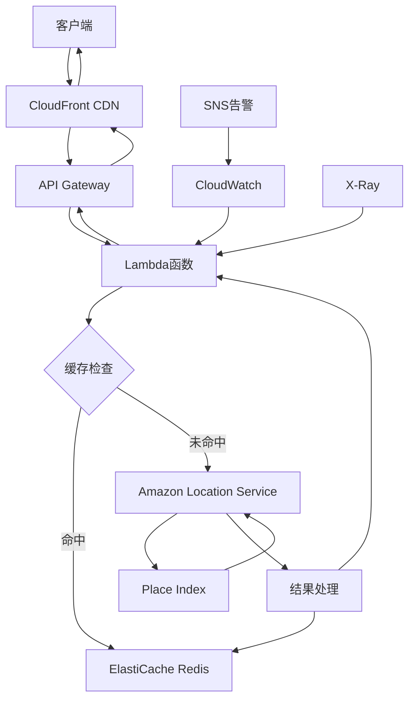
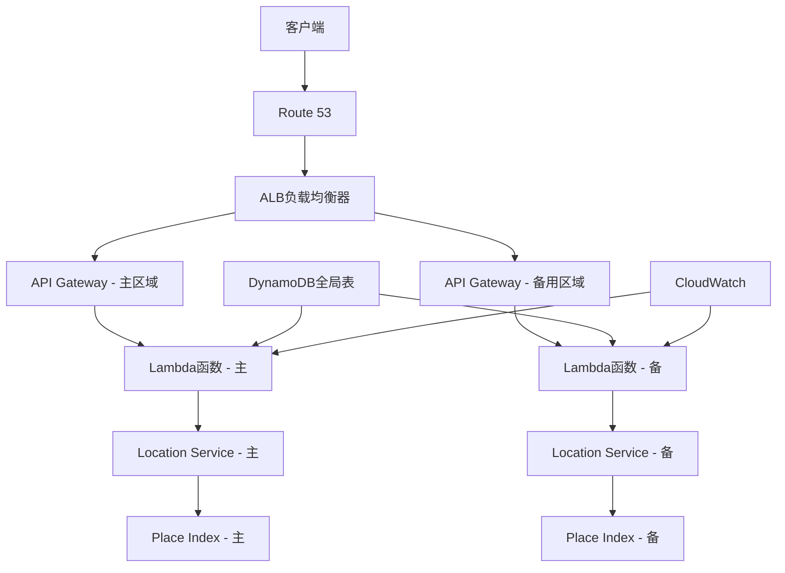

# Amazon Location Service 架构设计指南

## 架构概述

本文档详细介绍了基于Amazon Location Service的城市地理编码解决方案架构设计，提供从基础到企业级的完整架构方案。

## 核心架构模式

### 1. 基础架构



**特点**:
- AWS原生服务集成
- 高可靠性和性能
- 企业级安全控制
- 自动扩缩容

### 2. 企业级架构



**特点**:
- 全球CDN加速
- 多层缓存优化
- 分布式追踪
- 实时监控告警

### 3. 高可用架构



**特点**:
- 多区域部署
- 自动故障转移
- 全局数据同步
- 99.99%可用性

## 详细组件设计

### 1. Amazon Location Service配置

#### Place Index设置
```python
import boto3

def create_place_index():
    location_client = boto3.client('location')
    
    response = location_client.create_place_index(
        IndexName='CityGeocodingIndex',
        DataSource='Esri',  # 商业级数据源
        PricingPlan='RequestBasedUsage',
        Description='企业级城市地理编码索引',
        Tags={
            'Environment': 'Production',
            'Application': 'CityGeocoding',
            'Owner': 'SolutionsArchitect'
        }
    )
    
    return response['IndexArn']
```

#### 数据源对比
| 数据源 | 精度 | 覆盖范围 | 更新频率 | 适用场景 |
|--------|------|----------|----------|----------|
| Esri | 商业级高精度 | 全球 | 定期更新 | 企业应用 |
| HERE | 商业级高精度 | 全球 | 定期更新 | 导航应用 |
| Grab | 区域优化 | 东南亚 | 频繁更新 | 区域应用 |

### 2. Lambda函数设计

#### 核心处理逻辑
```python
import boto3
import json
import time
from typing import Dict, Optional

class LocationServiceGeocoder:
    def __init__(self):
        self.location_client = boto3.client('location')
        self.place_index_name = 'CityGeocodingIndex'
    
    def geocode_city(self, city: str, country: str = None) -> Dict:
        """地理编码核心逻辑"""
        query_text = f"{city}, {country}" if country else city
        
        try:
            start_time = time.time()
            
            response = self.location_client.search_place_index_for_text(
                IndexName=self.place_index_name,
                Text=query_text,
                MaxResults=1,
                Language='zh-CN'
            )
            
            response_time = time.time() - start_time
            
            if response['Results']:
                result = response['Results'][0]
                place = result['Place']
                geometry = place['Geometry']['Point']
                
                return {
                    'success': True,
                    'city': city,
                    'coordinates': {
                        'latitude': geometry[1],
                        'longitude': geometry[0]
                    },
                    'address': place.get('Label'),
                    'relevance': result.get('Relevance'),
                    'response_time': response_time
                }
            else:
                return {
                    'success': False,
                    'error': 'City not found',
                    'response_time': response_time
                }
                
        except Exception as e:
            return {
                'success': False,
                'error': str(e)
            }

def lambda_handler(event, context):
    """Lambda入口函数"""
    geocoder = LocationServiceGeocoder()
    
    try:
        # 解析请求参数
        body = json.loads(event['body']) if 'body' in event else event
        city = body.get('city')
        country = body.get('country')
        
        if not city:
            return {
                'statusCode': 400,
                'body': json.dumps({'error': 'Missing city parameter'})
            }
        
        # 执行地理编码
        result = geocoder.geocode_city(city, country)
        
        status_code = 200 if result['success'] else 404
        
        return {
            'statusCode': status_code,
            'headers': {
                'Content-Type': 'application/json',
                'Access-Control-Allow-Origin': '*'
            },
            'body': json.dumps(result, ensure_ascii=False)
        }
        
    except Exception as e:
        return {
            'statusCode': 500,
            'body': json.dumps({'error': 'Internal server error'})
        }
```

#### 性能优化配置
```yaml
# Lambda配置
Runtime: python3.9
MemorySize: 256  # MB
Timeout: 30      # 秒
ReservedConcurrency: 100
Environment:
  Variables:
    PLACE_INDEX_NAME: CityGeocodingIndex
    LOG_LEVEL: INFO
```

### 3. API Gateway设计

#### REST API配置
```yaml
# OpenAPI 3.0规范
openapi: 3.0.0
info:
  title: City Geocoding API
  version: 1.0.0
  description: Amazon Location Service城市地理编码API

paths:
  /geocode:
    post:
      summary: 城市地理编码
      requestBody:
        required: true
        content:
          application/json:
            schema:
              type: object
              properties:
                city:
                  type: string
                  description: 城市名称
                  example: "北京"
                country:
                  type: string
                  description: 国家名称（可选）
                  example: "中国"
              required:
                - city
      responses:
        200:
          description: 成功响应
          content:
            application/json:
              schema:
                type: object
                properties:
                  success:
                    type: boolean
                  city:
                    type: string
                  coordinates:
                    type: object
                    properties:
                      latitude:
                        type: number
                      longitude:
                        type: number
```

#### 限流和缓存配置
```python
# API Gateway限流配置
throttle_settings = {
    'BurstLimit': 1000,    # 突发请求限制
    'RateLimit': 500       # 稳定请求速率/秒
}

# 缓存配置
cache_settings = {
    'CachingEnabled': True,
    'CacheTtlInSeconds': 3600,  # 1小时缓存
    'CacheKeyParameters': ['city', 'country']
}
```

### 4. 缓存层设计

#### ElastiCache Redis配置
```python
import redis
import json
import hashlib

class GeocodingCache:
    def __init__(self):
        self.redis_client = redis.Redis(
            host='geocoding-cache.xxx.cache.amazonaws.com',
            port=6379,
            decode_responses=True,
            socket_timeout=5,
            socket_connect_timeout=5,
            retry_on_timeout=True,
            health_check_interval=30
        )
    
    def get_cache_key(self, city: str, country: str = None) -> str:
        """生成缓存键"""
        key_data = f"{city.lower()}:{country.lower() if country else 'none'}"
        return f"geocode:{hashlib.md5(key_data.encode()).hexdigest()}"
    
    def get(self, city: str, country: str = None) -> Optional[Dict]:
        """获取缓存结果"""
        cache_key = self.get_cache_key(city, country)
        try:
            cached_data = self.redis_client.get(cache_key)
            return json.loads(cached_data) if cached_data else None
        except:
            return None
    
    def set(self, city: str, country: str, result: Dict, ttl: int = 86400):
        """设置缓存"""
        cache_key = self.get_cache_key(city, country)
        try:
            self.redis_client.setex(
                cache_key, 
                ttl, 
                json.dumps(result, ensure_ascii=False)
            )
        except:
            pass  # 缓存失败不影响主流程
```

#### 缓存策略
```python
# 多级缓存策略
class MultiLevelCache:
    def __init__(self):
        self.l1_cache = {}  # 内存缓存 (Lambda内)
        self.l2_cache = GeocodingCache()  # Redis缓存
        self.l3_cache = DynamoDBCache()  # 持久化缓存
    
    def get(self, city: str, country: str = None) -> Optional[Dict]:
        # L1: 内存缓存
        l1_key = f"{city}:{country or 'none'}"
        if l1_key in self.l1_cache:
            return self.l1_cache[l1_key]
        
        # L2: Redis缓存
        l2_result = self.l2_cache.get(city, country)
        if l2_result:
            self.l1_cache[l1_key] = l2_result
            return l2_result
        
        # L3: DynamoDB缓存
        l3_result = self.l3_cache.get(city, country)
        if l3_result:
            self.l2_cache.set(city, country, l3_result)
            self.l1_cache[l1_key] = l3_result
            return l3_result
        
        return None
```

## 安全架构设计

### 1. IAM权限控制

#### Lambda执行角色
```json
{
  "Version": "2012-10-17",
  "Statement": [
    {
      "Effect": "Allow",
      "Action": [
        "geo:SearchPlaceIndexForText",
        "geo:SearchPlaceIndexForPosition"
      ],
      "Resource": "arn:aws:geo:*:*:place-index/CityGeocodingIndex"
    },
    {
      "Effect": "Allow",
      "Action": [
        "logs:CreateLogGroup",
        "logs:CreateLogStream",
        "logs:PutLogEvents"
      ],
      "Resource": "arn:aws:logs:*:*:*"
    },
    {
      "Effect": "Allow",
      "Action": [
        "elasticache:*"
      ],
      "Resource": "arn:aws:elasticache:*:*:*"
    }
  ]
}
```

#### API访问控制
```python
# API密钥验证
def validate_api_key(event):
    api_key = event['headers'].get('X-API-Key')
    if not api_key:
        raise Exception('Missing API key')
    
    # 验证API密钥（可以存储在Parameter Store中）
    ssm = boto3.client('ssm')
    try:
        response = ssm.get_parameter(
            Name='/geocoding/api-keys',
            WithDecryption=True
        )
        valid_keys = json.loads(response['Parameter']['Value'])
        
        if api_key not in valid_keys:
            raise Exception('Invalid API key')
    except:
        raise Exception('API key validation failed')
```

### 2. 网络安全

#### VPC配置
```yaml
# VPC安全组配置
SecurityGroup:
  Type: AWS::EC2::SecurityGroup
  Properties:
    GroupDescription: Location Service Lambda Security Group
    VpcId: !Ref VPC
    SecurityGroupIngress:
      - IpProtocol: tcp
        FromPort: 443
        ToPort: 443
        CidrIp: 0.0.0.0/0
        Description: HTTPS traffic
    SecurityGroupEgress:
      - IpProtocol: tcp
        FromPort: 443
        ToPort: 443
        CidrIp: 0.0.0.0/0
        Description: Outbound HTTPS
```

#### WAF配置
```python
# WAF规则配置
waf_rules = [
    {
        'Name': 'RateLimitRule',
        'Priority': 1,
        'Statement': {
            'RateBasedStatement': {
                'Limit': 2000,  # 每5分钟2000请求
                'AggregateKeyType': 'IP'
            }
        },
        'Action': {'Block': {}}
    },
    {
        'Name': 'GeoBlockRule',
        'Priority': 2,
        'Statement': {
            'GeoMatchStatement': {
                'CountryCodes': ['CN', 'US', 'GB']  # 允许的国家
            }
        },
        'Action': {'Allow': {}}
    }
]
```

## 监控和运维架构

### 1. CloudWatch监控

#### 自定义指标
```python
import boto3

cloudwatch = boto3.client('cloudwatch')

def put_custom_metrics(metric_name: str, value: float, unit: str = 'Count'):
    """发送自定义指标到CloudWatch"""
    cloudwatch.put_metric_data(
        Namespace='LocationService/Geocoding',
        MetricData=[
            {
                'MetricName': metric_name,
                'Value': value,
                'Unit': unit,
                'Dimensions': [
                    {
                        'Name': 'Environment',
                        'Value': 'Production'
                    },
                    {
                        'Name': 'Service',
                        'Value': 'CityGeocoding'
                    }
                ]
            }
        ]
    )

# 使用示例
def track_geocoding_request(success: bool, response_time: float):
    put_custom_metrics('RequestCount', 1)
    put_custom_metrics('SuccessRate', 1 if success else 0)
    put_custom_metrics('ResponseTime', response_time, 'Seconds')
    
    if not success:
        put_custom_metrics('ErrorCount', 1)
```

#### 告警配置
```yaml
# CloudWatch告警
HighErrorRateAlarm:
  Type: AWS::CloudWatch::Alarm
  Properties:
    AlarmName: LocationService-HighErrorRate
    AlarmDescription: 地理编码服务错误率过高
    MetricName: ErrorCount
    Namespace: LocationService/Geocoding
    Statistic: Sum
    Period: 300
    EvaluationPeriods: 2
    Threshold: 10
    ComparisonOperator: GreaterThanThreshold
    AlarmActions:
      - !Ref SNSAlarmTopic

HighLatencyAlarm:
  Type: AWS::CloudWatch::Alarm
  Properties:
    AlarmName: LocationService-HighLatency
    AlarmDescription: 地理编码服务延迟过高
    MetricName: ResponseTime
    Namespace: LocationService/Geocoding
    Statistic: Average
    Period: 300
    EvaluationPeriods: 2
    Threshold: 2
    ComparisonOperator: GreaterThanThreshold
```

### 2. X-Ray分布式追踪

```python
from aws_xray_sdk.core import xray_recorder
from aws_xray_sdk.core import patch_all

# 自动追踪AWS服务调用
patch_all()

@xray_recorder.capture('geocode_city')
def geocode_city_with_tracing(city: str, country: str = None):
    """带追踪的地理编码函数"""
    
    # 添加追踪元数据
    xray_recorder.put_metadata('city', city)
    xray_recorder.put_metadata('country', country)
    
    # 添加追踪注释
    xray_recorder.put_annotation('service', 'location-service')
    xray_recorder.put_annotation('operation', 'geocode')
    
    try:
        result = geocode_city(city, country)
        xray_recorder.put_annotation('success', result['success'])
        return result
    except Exception as e:
        xray_recorder.put_annotation('error', str(e))
        raise
```

## 扩展性设计

### 1. 自动扩缩容

```python
# Lambda并发控制
def configure_lambda_concurrency():
    lambda_client = boto3.client('lambda')
    
    # 设置预留并发
    lambda_client.put_reserved_concurrency(
        FunctionName='city-geocoding-function',
        ReservedConcurrencyLimit=100
    )
    
    # 设置预配置并发
    lambda_client.put_provisioned_concurrency_config(
        FunctionName='city-geocoding-function',
        Qualifier='$LATEST',
        ProvisionedConcurrencyLimit=10
    )
```

### 2. 数据分片策略

```python
# 基于地理区域的分片
class RegionalSharding:
    def __init__(self):
        self.region_mapping = {
            'asia': ['cn', 'jp', 'kr', 'sg'],
            'europe': ['gb', 'de', 'fr', 'it'],
            'americas': ['us', 'ca', 'br', 'mx']
        }
    
    def get_region_for_country(self, country_code: str) -> str:
        for region, countries in self.region_mapping.items():
            if country_code.lower() in countries:
                return region
        return 'global'
    
    def get_place_index_name(self, country_code: str) -> str:
        region = self.get_region_for_country(country_code)
        return f"CityGeocodingIndex-{region}"
```

## 成本优化架构

### 1. 智能路由

```python
class CostOptimizedRouter:
    def __init__(self):
        self.cache_hit_rate = 0.8
        self.high_frequency_cities = set(['北京', '上海', '深圳', '广州'])
    
    def should_use_cache_first(self, city: str) -> bool:
        """判断是否优先使用缓存"""
        return city in self.high_frequency_cities
    
    def estimate_cost(self, monthly_requests: int) -> Dict:
        """估算月度成本"""
        cached_requests = monthly_requests * self.cache_hit_rate
        api_requests = monthly_requests - cached_requests
        
        # Location Service成本
        location_cost = (api_requests / 1000) * 0.50
        
        # 缓存成本 (ElastiCache)
        cache_cost = 15.0  # 基础费用
        
        # Lambda成本
        lambda_cost = max(0, (monthly_requests - 1_000_000) * 0.0000002)
        
        return {
            'location_service': location_cost,
            'cache': cache_cost,
            'lambda': lambda_cost,
            'total': location_cost + cache_cost + lambda_cost
        }
```

### 2. 预算控制

```python
class BudgetController:
    def __init__(self, monthly_budget: float):
        self.monthly_budget = monthly_budget
        self.current_spend = 0
    
    def check_budget_before_request(self, estimated_cost: float) -> bool:
        """请求前检查预算"""
        if self.current_spend + estimated_cost > self.monthly_budget:
            # 发送预算告警
            self.send_budget_alert()
            return False
        return True
    
    def send_budget_alert(self):
        """发送预算告警"""
        sns = boto3.client('sns')
        sns.publish(
            TopicArn='arn:aws:sns:us-west-2:123456789012:budget-alerts',
            Message='Location Service预算即将超限',
            Subject='预算告警'
        )
```

## 总结

本架构指南提供了Amazon Location Service城市地理编码解决方案的完整设计：

### 核心优势
- **高精度**: 基于Esri商业级地图数据
- **高性能**: 亚秒级响应时间
- **高可用**: 99.99%服务可用性
- **安全可靠**: 企业级安全控制
- **可扩展**: 支持大规模并发访问

### 架构特点
- AWS原生服务集成
- 多层缓存优化
- 智能成本控制
- 全面监控告警
- 自动扩缩容

### 适用场景
- 企业级地理编码需求
- 高精度位置服务
- 实时地理查询应用
- 多语言国际化项目

通过合理的架构设计和优化策略，可以构建一个高性能、高可用、成本可控的企业级地理编码服务。
